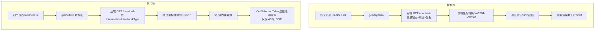

## 性能优化需求

分析四个页面（PCI规划、邻区规划、TAC核查、TAC规划）中"小区选择"tab加载小区列表极慢的原因，并给出优化方案。优化目标是切换"小区选择"tab时能在 500ms 内完成加载和渲染。

## 问题根因

三层瓶颈：

1. **数据获取层**：四个页面的 `loadCellList` 均调用 `mapDataService.getMapData(12, false)`，该函数会：

- 调用后端 `GET /api/v1/map/data` 获取完整站点数据
- 对每个扇区进行 `extractSectorsFromSites()` 展平（遍历站点内所有扇区）
- 逐条 `validateSectors()` 验证经纬度/方位角
- 逐条 `transformCoordinates()` WGS84->GCJ02 坐标转换
- `applyLOD()` 应用LOD截断
- 而小区选择列表实际只需要 `id`, `name`, `siteId` 三个字段

2. **渲染层**：四个页面均使用原生 `<table>` 全量渲染所有行（数千行DOM），无虚拟滚动

3. **缓存层**：`loadCellList` 的 `useCallback` 依赖数组为 `[]`，不同页面间数据不共享，相同页面切换tab后重新获取

## 技术方案

### 架构图



### 优化方案：三管齐下

#### 1. 后端新增轻量 API `GET /api/v1/map/cells`

**新增文件**: `backend/app/api/v1/endpoints/map.py`

新增端点 `GET /api/v1/map/cells`，返回小区选择所需的精简数据：

```python
@router.get("/cells", response_model=Dict[str, Any])
async def get_cell_list(limit: int = 50000) -> Dict[str, Any]:
    """获取小区选择列表（轻量API，不含坐标转换）"""
    # 复用现有的 _load_map_data_from_files() 缓存
    # 但只提取 id/name/siteId/networkType 四个字段
    # 跳过坐标计算、边界计算
    # 按 networkType 分组返回 { lte: [...], nr: [...] }
```

**关键设计决策**：

- 复用现有的 `_load_map_data_from_files()` 函数和缓存机制（5分钟TTL），避免重复的文件IO
- 在拿到 `all_sites` 后，只提取需要的字段，不做坐标转换和边界计算
- 展平扇区结构并分类为 LTE/NR

#### 2. 前端新增轻量获取方法 `getCellList()`

**修改文件**: `frontend/src/renderer/services/mapDataService.ts`

新增方法：

```typescript
export interface CellListItem {
  id: string
  siteId: string
  name: string
  networkType: 'LTE' | 'NR'
}

export interface CellListResponse {
  lte: CellListItem[]
  nr: CellListItem[]
}

// 独立缓存（5分钟，比地图缓存更长）
let _cellListCache: { data: CellListResponse | null; time: number } = {
  data: null, time: 0
}
const CELL_LIST_CACHE_TTL = 5 * 60 * 1000
```

- 独立的缓存变量，TTL设为5分钟（因为小区列表不常变）
- 不经过IndexedDB（数据轻量，内存缓存即可）
- 跳过坐标转换、扇区验证、LOD截断

#### 3. 封装共享虚拟滚动组件 `CellSelectionTable`

**新文件**: `frontend/src/renderer/components/CellSelectionTable/CellSelectionTable.tsx`

参照 `NeighborPage.tsx` 中 `NeighborTable` 的手工虚拟滚动实现，封装为可复用组件：

```typescript
interface CellSelectionTableProps {
  sectors: Array<{ id: string; siteId?: string; name?: string }>
  selectedCellIds: Set<string>
  onToggleCell: (cellId: string) => void
  columns?: { siteId: string; sectorId: string; sectorName: string }
}
```

虚拟滚动核心参数：

- `ITEM_HEIGHT = 40px`
- `VISIBLE_COUNT = 25`
- `BUFFER_COUNT = 5`

保持与规划结果表格一致的样式：`bg-muted` 表头、`border-r border-border` 网格线、`divide-y divide-border` 行线、`bg-card hover:bg-muted/50` 行样式

#### 4. 四个页面统一改造

每个页面：

- 移除内部 `cellListData` 状态变量，或保持但改为 `CellListItem[]` 类型
- `loadCellList` 改为调用 `mapDataService.getCellList()` 而非 `getMapData()`
- 渲染使用 `<CellSelectionTable>` 替换原始 `<table>` 或 `flex div`
- 网络类型切换时自动重新获取

### 性能收益估算

| 优化项 | 优化前 | 优化后 | 说明 |
| --- | --- | --- | --- |
| 后端处理 | ~200ms（全量数据+展平） | ~20ms（复用缓存+精简提取） | 省去坐标转换和边界计算 |
| 网络传输 | ~200KB（完整RenderSectorData） | ~50KB（仅3个字段） | 数据量减少约75% |
| DOM渲染 | 数千个`<tr>`节点 | ~30个`<tr>`节点 | 减少99%+ |
| 总感时间 | 1-3秒 | <300ms |  |
| 页面间切换 | 重新获取 | 命中5分钟缓存 | 零等待 |


### 不改动的部分

- 保持 `getMapData()` 原逻辑不变（不影响地图显示功能）
- 保持所有规划结果的展示逻辑不变
- 不引入新npm依赖
- 不修改后端规划算法