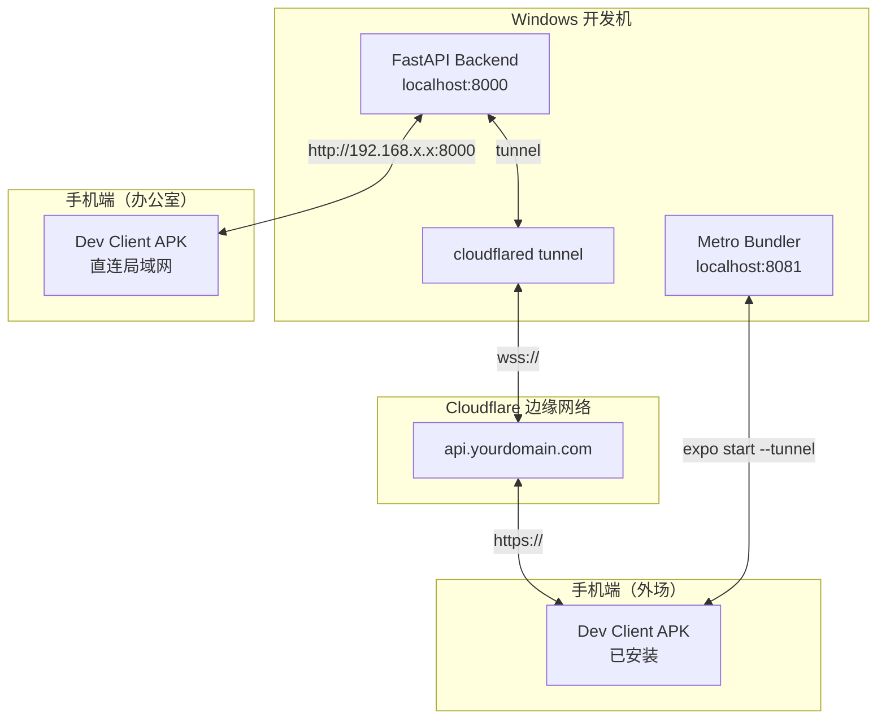

## 产品概述

将本地 Windows 机器上运行的网络规划工具后端（FastAPI :8000）通过 Cloudflare 暴露到外网，使已安装的移动端 App 能够在办公室内外无缝访问后端 API，同时支持外场 GPS 测试时的高效开发调试。

## 核心需求

1. **外网后端访问**：通过 Cloudflare Tunnel 将 localhost:8000 暴露为 https://api.yourdomain.com
2. **高效开发迭代**：构建一次 Dev Client APK（含 react-native-amap3d 等原生模块），后续纯 JS 代码变更通过 Metro Tunnel 热更新，无需反复构建 APK
3. **运行时 URL 切换**：App 内可手动切换后端地址（办公室走内网 LAN IP，外场走 https://api.yourdomain.com），无需重新安装
4. **一步一指导**：面向初学者的完整部署流程，从 Cloudflare 配置到代码修改再到构建运行

## 技术栈

- **后端暴露**：Cloudflare Tunnel（cloudflared）-> localhost:8000
- **移动端构建**：Expo Dev Client（EAS Build，含所有原生模块）
- **JS 热更新**：Expo Metro Bundler + `--tunnel` 模式
- **运行时配置**：AsyncStorage 持久化 + 请求拦截器动态 baseURL

## 系统架构



**数据流说明：**

- **外场 API 请求**：手机 App -> https://api.yourdomain.com/api/v1/... -> Cloudflare -> cloudflared -> localhost:8000
- **办公室 API 请求**：手机 App -> http://192.168.x.x:8000/api/v1/...（直连局域网，不经过 Cloudflare）
- **热更新（开发时）**：手机 Dev Client -> Expo Tunnel URL -> Cloudflare Edge -> Metro Bundler :8081

## 后端 CORS 配置修改

当前 `backend/app/api/__init__.py` 中的 CORS 配置只允许 localhost 和局域网 IP，需要补充 `https://api.yourdomain.com`。

通过环境变量 `NPT_CORS_ORIGINS` 配置，创建或修改 `backend/.env` 文件。

## 移动端运行时 API URL 切换

### 当前方案的局限性

`mobile-app/src/utils/config.ts` 中的 `BACKEND_CONFIG` 是模块加载时静态求值的常量，`api.ts` 中的 `ApiService` 构造函数也只执行一次，无法在运行时切换后端地址。

### 改造策略

1. **config.ts**：导出 `getEffectiveApiUrl()` 异步函数，优先级链为：AsyncStorage 自定义 URL > `EXPO_PUBLIC_API_URL` > LAN IP > localhost
2. **api.ts**：使用 Axios 请求拦截器，每次请求前动态计算 baseURL，避免修改所有现有方法签名
3. **设置页面 UI**：新增一个设置 Tab 或按钮，提供后端地址输入、保存、测试连接和重置功能

## 目录结构变更

```
mobile-app/
├── eas.json                         # [NEW] EAS Build 配置文件（development profile）
├── src/
│   ├── utils/
│   │   └── config.ts                # [MODIFY] 增加 AsyncStorage 运行时 URL 切换逻辑
│   └── services/
│       └── api.ts                   # [MODIFY] 请求拦截器动态配置 baseURL
├── app/
│   └── (tabs)/
│       ├── _layout.tsx              # [MODIFY] 增加"设置" Tab
│       ├── index.tsx                # [MODIFY] 增加连接状态指示器/设置入口
│       └── settings.tsx             # [NEW] 设置页面：后端地址输入/切换/测试

backend/
├── .env                             # [NEW] 添加 NPT_CORS_ORIGINS=https://api.yourdomain.com
└── app/
    └── api/
        └── __init__.py              # [MODIFY] CORS 中补充 Cloudflare 域名

scripts/
└── start-dev.ps1                    # [NEW] 一键启动脚本（cloudflared + backend + expo）
```

## 实现注意事项

### 性能

- 每次请求从 AsyncStorage 读取 URL 开销约 1-5ms，相对 30s 超时的 API 请求可忽略不计
- 在设置变更时将 URL 缓存到 Zustand store，减少重复读取

### 日志

- 后端日志保持 warning 级别避免编码问题
- cloudflared 自带详细日志，用 `--loglevel info` 可查看隧道状态

### 安全

- Cloudflare Tunnel 自动提供 SSL/HTTPS，源站完全隐藏
- 建议在 Cloudflare Dashboard 开启 Bot Fight Mode + WAF 规则
- 后端 `.env` 中的 `NPT_LICENSE_SECRET_KEY` 应使用强密钥

### 向后兼容

- LAN IP 自动发现和 localhost 回退逻辑完全保留
- CORS 通过环境变量控制，不修改现有白名单

### Cloudflare 免费版限制

- 单 Tunnel 最大 5 个并发连接
- 每月免费 1GB 流量（开发调试完全够用）
- WebSocket 原生支持

## Agent Extensions

### SubAgent

- **code-explorer**: 已用于调研后端 FastAPI 架构、移动端 API 连接方式、CORS 配置等关键信息。后续实施阶段可再次用于精确定位待修改代码行和验证配置正确性。

### Skill

- **fullstack-dev**: 用于指导 CORS 配置修改、API 客户端改造等前后端集成工作，确保方案遵循最佳实践并减少返工。