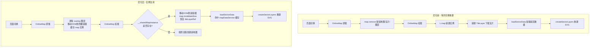

## 问题诊断

**根因确认**：每次在 PCI规划(`/pci`)、邻区规划(`/neighbor`)、TAC核查(`/tac`) 三个页面之间切换时，`OnlineMap` 组件被完全卸载并重建。

问题链：

1. React Router 路由切换导致当前页面 unmount，其内部的 `<OnlineMap>` 组件随之卸载
2. OnlineMap 的 `useEffect` 清理函数调用 `mapInstanceRef.current.remove()` 销毁 Leaflet 地图实例（含瓦片图层和所有扇区图层）
3. 新页面 mount，重新创建 `<OnlineMap>` → 重新 `L.map()` → 新建 TileLayer → → 重新下载所有瓦片 → 重新加载扇区数据 → 重建所有 SVG 扇区图层
4. zoom 越小需要下载的瓦片数量越多（zoom 8 约 65,536 张），瓦片重新下载是最大的性能瓶颈
5. TAC规划页面（无地图）切换流畅，佐证了地图重建是问题的核心

## 优化方案

**核心策略**：保持 Leaflet 地图实例在页面切换时存活，避免地图重建和瓦片重新下载。

**具体方法**：在 `OnlineMap.tsx` 内部添加共享实例缓存机制。当组件卸载时，不销毁 Leaflet 地图实例，而是将其 DOM 容器移动到隐藏的 `<div>` 中存储；当组件在新页面重新挂载时，从缓存中取出地图实例，将其 DOM 移动到新页面的容器中，通过 `map.invalidateSize()` 刷新显示。

**无需修改各页面组件（PCIPage/NeighborPage/TACPage）**，所有变化封装在 `OnlineMap.tsx` 内部。各页面的 JSX 结构、props 传递方式、业务逻辑均保持不变。

## 预期效果

| 场景 | 当前 | 优化后 |
| --- | --- | --- |
| 切换 PCI / 邻区 / TAC 核查 | 地图销毁重建 + 瓦片全量重载 + 扇区重建 | 仅移动 DOM + invalidateSize，秒级响应 |
| zoom 较小 (< 10) 时切换 | 大量瓦片重载，卡顿 3-5 秒 | 瓦片保持缓存，零等待 |
| 切换回首页或非地图页面 | OnlineMap 隐藏存储 | 保持实例，返回时立即可用 |
| 初次进入任意地图页面 | 需要创建新实例 | 同现状（不可避免） |
| 切换到 `/map` 地图工具页面 | OnlineMap 正常创建 | 同现状（因 map 的 mode 为 default，不应用共享缓存） |


## 技术栈

- 前端框架: React 18 + TypeScript
- 地图库: Leaflet 1.9.4
- 路由: react-router-dom v6

## 核心策略

在 `OnlineMap.tsx` 内部使用 **模块级全局单例** 缓存 Leaflet 地图实例，页面切换时只移动 DOM 容器而非重建地图。

## 架构图



## 数据流

```
[PCI 页面]                    [邻区 页面]                   [TAC 页面]
  <OnlineMap                    <OnlineMap                    <OnlineMap
    mode="pci-planning"           mode="neighbor-planning"      mode="tac-check"
    pciData={...}                 neighborData={...}            onSectorClick={...}
    onSectorClick={...}           onSectorClick={...}          />
    measureMode={...}             measureMode={...}             
  />                            />                             共同指向同一个 Leaflet 实例
     |                              |                             |
     | useImperativeHandle           |                             |
     v                              v                             v
  [OnlineMapRef]  (各页面独立的 React ref, forwardRef 机制)
     |
     v
  [OnlineMap 组件]  (每个页面挂载时创建，卸载时销毁)
     | 模块级变量 __sharedMapInstance (跨组件实例持久化)
     v
  [Leaflet Map 实例]  (唯一实例，在页面切换时只移动 DOM 容器，不销毁)
     |
     ├─ TileLayer (高德地图瓦片 - 页面切换时保留，不重新下载)
     ├─ SectorSVGLayer (LTE/NR - 页面切换时重建)
     ├─ MapInfoLayerManager (页面切换时清理)
     └─ GeoDataLayerManager (页面切换时清理)
```

## 技术细节

### OnlineMap.tsx 改造方案

**1. 模块级变量（位于 import 下方，component 外部）**

```typescript
// 共享地图实例缓存（用于三个规划页面的地图复用）
let __sharedMapInstance: L.Map | null = null
let __sharedHiddenContainer: HTMLDivElement | null = null
```

**2. 初始化 useEffect 新增复用路径（在 `initMap()` 函数开头）**

```typescript
const initMap = async () => {
  // ---- 新增：复用路径 ----
  if (__sharedMapInstance && mode !== 'default') {
    const map = __sharedMapInstance
    __sharedMapInstance = null  // 取走后清空，防止重复使用
    
    const container = mapRef.current
    if (!container) return
    
    // 检查容器是否已被 Leaflet 占用，清理残留
    const hasLeafletMap = container.querySelector('.leaflet-container')
    if (hasLeafletMap) {
      container.innerHTML = ''
    }
    
    // 将共享地图的 DOM 移动到新页面容器
    const mapEl = map.getContainer()
    if (mapEl.parentElement) {
      mapEl.remove()
    }
    container.appendChild(mapEl)
    
    // 恢复 tileLayerRef（遍历地图上已存在的 TileLayer）
    map.eachLayer((layer: any) => {
      if (layer instanceof L.TileLayer) {
        tileLayerRef.current = layer
      }
    })
    
    map.invalidateSize()
    mapInstanceRef.current = map
    setLoading(false)
    setIsMapInitialized(true)
    
    // 为新页面模式加载扇区数据
    await loadSectorData()
    return
  }
  // ---- 原初始化逻辑不变 ----
  // ...
}
```

**3. 清理函数改造（不销毁，改为存储）**

```typescript
return () => {
  if (mapInstanceRef.current) {
    const map = mapInstanceRef.current
    
    // 清空所有 overlay 图层（扇区/MapInfo/GeoData）
    if (lteSectorLayerRef.current) { 
      map.removeLayer(lteSectorLayerRef.current)
      lteSectorLayerRef.current = null
    }
    if (nrSectorLayerRef.current) {
      map.removeLayer(nrSectorLayerRef.current)
      nrSectorLayerRef.current = null
    }
    if (mapInfoLayerManagerRef.current) { 
      mapInfoLayerManagerRef.current.clear()
      mapInfoLayerManagerRef.current = null
    }
    if (geoDataLayerManagerRef.current) {
      geoDataLayerManagerRef.current.clear()
      geoDataLayerManagerRef.current = null
    }
    
    // 如果是带 mode 的页面（PCI/邻区/TAC），缓存实例
    // 否则（mode === 'default'），按原逻辑销毁
    if (mode !== 'default') {
      // 创建隐藏容器
      if (!__sharedHiddenContainer) {
        __sharedHiddenContainer = document.createElement('div')
        __sharedHiddenContainer.style.display = 'none'
        document.body.appendChild(__sharedHiddenContainer)
      }
      // 将地图 DOM 移入隐藏容器
      const mapEl = map.getContainer()
      __sharedHiddenContainer.appendChild(mapEl)
      __sharedMapInstance = map
    } else {
      // 默认模式（MapPage 等）：原样销毁
      map.remove()
    }
    mapInstanceRef.current = null
  }
  
  // 其余清理逻辑（定时器/事件监听/图层引用）不变
  // ...
}
```

## 不改动部分

- **各页面 JSX**: PCIPage、NeighborPage、TACPage 的 JSX 结构不变，`<OnlineMap>` 的渲染位置、props、`mapRef` 引用方式均不变
- **业务逻辑**: 各页面的同步服务初始化、规划任务执行、结果展示、图例控制、扇区点击回调等保持不变
- **扇区数据缓存**: `mapDataService` 的缓存机制不变，`loadSectorData()` 在复用地时命中缓存
- **MapPage**: `/map` 路径使用 `mode='default'`，仍按原流程创建/销毁地图，不受此优化影响

## 目录结构

```
frontend/src/renderer/components/Map/
├── OnlineMap.tsx    # [MODIFY] 新增共享地图实例缓存逻辑，约增加 150 行代码
```

## 子代理

- **code-explorer**: 已完成代码探索阶段，用于验证后端 API 接口、前端数据服务、现有模式和数据流